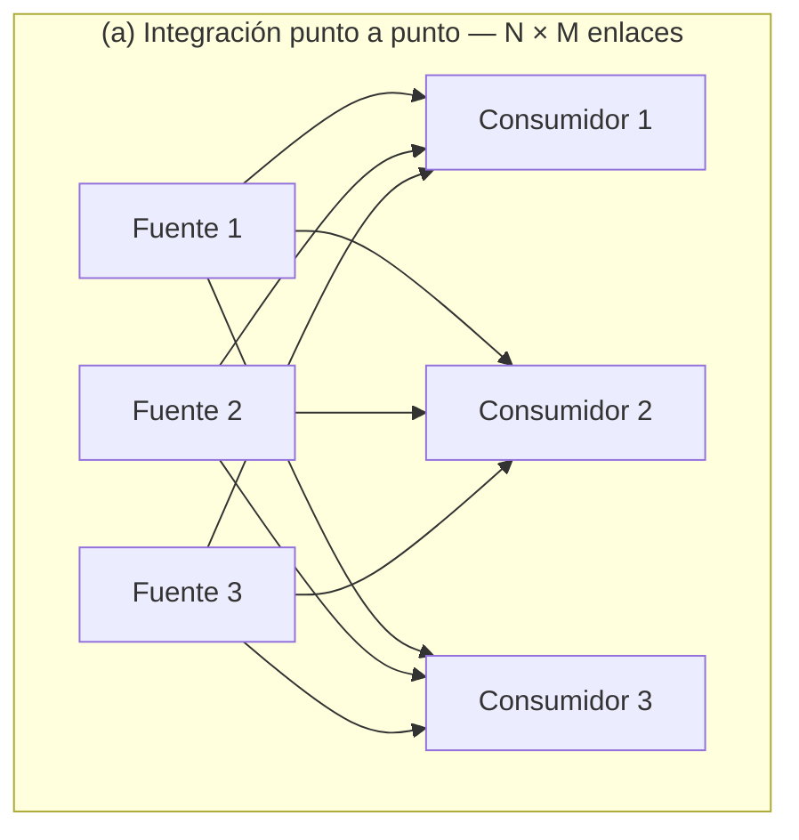
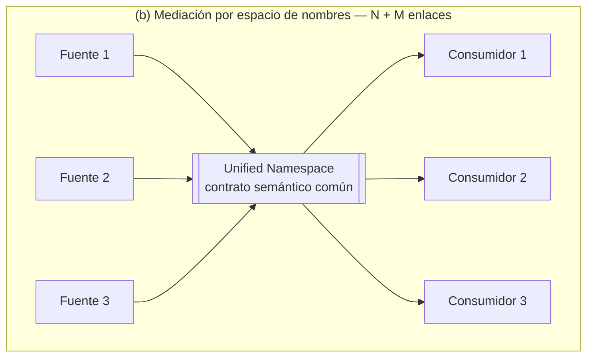
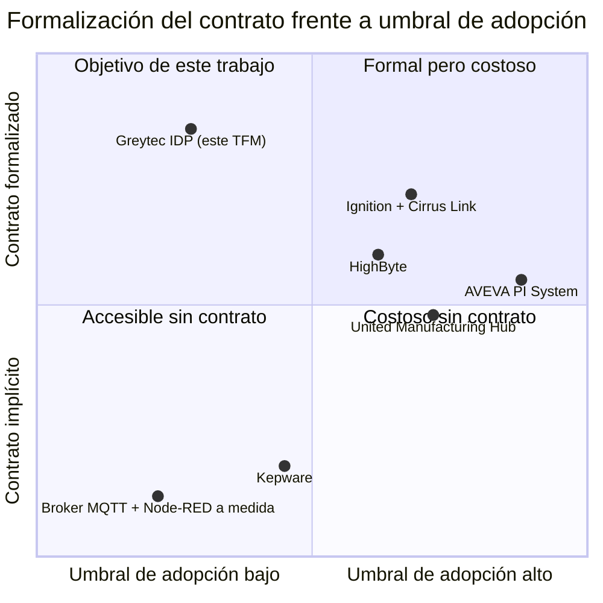

# Capítulo 2. ESTADO DEL ARTE

> **TFM:** Diseño, implementación y validación de una arquitectura de referencia basada en Unified Namespace para la interoperabilidad OT-IT en entornos industriales
> **Autor:** José Fernando Desiderio Moreira · **Director:** Santiago Díaz Domínguez
> **Norma de citación:** IEEE numérica. Las referencias `[n]` remiten a `bibliografia.md`, que mantiene la numeración corrida de toda la memoria.
> **Estado del capítulo:** borrador de trabajo v1.0 — 2026-08-14

---

El capítulo anterior estableció el problema —la integración punto a punto entre fuentes OT y consumidores IT crece con un coste del orden de N × M y se opone al cambio— y la pregunta de investigación que de él se deriva. Este capítulo examina qué respuestas existen ya a ese problema: qué se ha publicado en la literatura científica, qué prescriben los estándares del dominio, qué ofrecen los proveedores comerciales y qué han construido las comunidades de código abierto. El objetivo no es catalogar, sino delimitar con precisión **qué queda sin resolver**, porque esa brecha es la que justifica el trabajo que se desarrolla en los capítulos siguientes.

La revisión se organiza en siete secciones. La primera declara la metodología y sus límites. La segunda caracteriza el problema de integración OT-IT tal y como lo describe la literatura. La tercera aborda el concepto de *Unified Namespace* (UNS): su origen, sus definiciones en circulación y su tratamiento académico. La cuarta recorre los estándares y modelos de referencia del dominio como panorama de lo que existe —su fundamentación como herramienta de diseño se desarrolla en el Capítulo 3—. La quinta y la sexta revisan, respectivamente, las soluciones comerciales y las alternativas de código abierto. La séptima sintetiza el análisis de brecha y posiciona la contribución de este trabajo.

---

## 2.1 METODOLOGÍA Y ALCANCE DE LA REVISIÓN

### 2.1.1 Estrategia de búsqueda

La revisión sigue, de forma adaptada y proporcionada al alcance de un Trabajo de Fin de Máster, el protocolo de revisión sistemática propuesto por Kitchenham y Charters [1]: definición previa de preguntas de revisión, declaración de fuentes y cadenas de búsqueda, criterios explícitos de inclusión y exclusión, y extracción estructurada de resultados. No se trata de una revisión sistemática completa —no se ejecutó doble cribado independiente ni evaluación formal de calidad—, y se declara así por honestidad metodológica.

Las preguntas que guiaron la revisión fueron:

- **PR1.** ¿Existe una definición normativa o consensuada de Unified Namespace, y qué propiedades se le atribuyen?
- **PR2.** ¿Qué estándares del dominio industrial cubren, total o parcialmente, las funciones que el UNS pretende resolver?
- **PR3.** ¿Qué soluciones —comerciales o abiertas— implementan hoy arquitecturas de este tipo, y bajo qué condiciones de coste, licencia y acoplamiento?
- **PR4.** ¿Qué evidencia cuantitativa se ha publicado sobre el desempeño de estas arquitecturas (latencia, pérdida de mensajes, coste de integración)?

### 2.1.2 Fuentes consultadas

Una particularidad de este dominio obliga a un tratamiento de fuentes poco habitual: el UNS es un concepto **nacido en la práctica industrial**, difundido por consultores e integradores antes de ser objeto de estudio académico. Restringir la revisión a bases de datos indexadas produciría un estado del arte artificialmente pobre y ciego al objeto real de estudio. Se incorpora por tanto literatura gris —libros blancos de proveedores, documentación técnica de producto y divulgación especializada— pero **etiquetada como tal** y sometida a un criterio de uso restrictivo: la literatura gris se emplea para documentar *qué afirma la industria* y *qué ofrecen los productos*, nunca como evidencia de desempeño.

**Tabla 2.1.** Fuentes consultadas, por tipo y función en la revisión.

| Tipo de fuente | Repositorios / origen | Función en la revisión | Criterio de uso |
|---|---|---|---|
| Literatura científica indexada | IEEE Xplore, MDPI, ScienceDirect, Google Scholar | Estado de consolidación académica del concepto; evidencia empírica | Evidencia primaria |
| Especificaciones normativas | ISA, IEC, ISO, OASIS, Eclipse Foundation, NAMUR | Qué prescriben los estándares y qué dejan fuera | Fuente autoritativa |
| Arquitecturas de referencia | Plattform Industrie 4.0, Industry IoT Consortium, NIST | Marcos macro de posicionamiento | Fuente autoritativa |
| Documentación de producto | Proveedores comerciales y proyectos abiertos | Capacidades declaradas, modelo de licencia | Descriptiva; no evidencia de desempeño |
| Literatura gris especializada | Libros blancos, divulgación técnica de fabricantes | Origen y difusión del concepto UNS | Documenta el discurso, no lo valida |

Cadenas de búsqueda principales: `"unified namespace" AND (manufacturing OR industrial OR IIoT)`, `"unified namespace" AND (MQTT OR ISA-95 OR "ISA 95")`, `("OT/IT convergence" OR "IT/OT integration") AND architecture AND (interoperability OR "data platform")`, `MQTT AND Sparkplug AND (interoperability OR "industrial IoT")`. Ventana temporal: 2016-2026 para la literatura sobre UNS y convergencia OT-IT; sin restricción temporal para obras canónicas de arquitectura de datos y patrones de integración, cuya vigencia es independiente de su fecha.

### 2.1.3 Criterios de inclusión y exclusión

**Se incluyen** trabajos que (i) proponen, evalúan o implementan arquitecturas de integración de datos industriales orientadas a eventos; (ii) tratan la interoperabilidad OT-IT como problema arquitectónico y no meramente protocolar; o (iii) especifican normativamente alguna de las capas implicadas (semántica, transporte, seguridad, diagnóstico).

**Se excluyen** trabajos centrados exclusivamente en algoritmos de analítica o aprendizaje automático sobre datos ya integrados —el problema de este TFM es *cómo llega el dato en condiciones útiles*, no qué se calcula después—; despliegues de IoT de consumo sin restricciones OT; y material puramente promocional sin descripción técnica verificable.

### 2.1.4 Limitaciones declaradas

Tres limitaciones deben tenerse presentes al leer este capítulo. **Primera:** el volumen de literatura científica específica sobre UNS es reducido, lo que impide un metaanálisis y obliga a apoyar parte del panorama en fuentes industriales. Esta escasez no es un defecto de la revisión sino **un hallazgo de la revisión**, y se retoma en §2.3.5. **Segunda:** el acceso a las especificaciones normativas de pago (serie IEC 62443, NAMUR NE 175/176/177, IEC 62264) se realizó a través de la documentación pública de los organismos emisores y de literatura secundaria; se citan por su designación oficial. **Tercera:** la comparativa de soluciones comerciales (§2.5) se apoya en documentación de producto y, en el caso de HighByte Intelligence Hub, en una evaluación práctica realizada en el laboratorio de este trabajo; para el resto de productos no se dispone de verificación experimental propia y así se indica.

---

## 2.2 EL PROBLEMA DE LA INTEGRACIÓN OT-IT

### 2.2.1 La pirámide de automatización y su agotamiento

El modelo jerárquico que ha organizado la arquitectura industrial durante tres décadas procede de la *Purdue Enterprise Reference Architecture* (PERA), formulada por Williams [2], y de su posterior normalización en ISA-95 / IEC 62264 [3]. Su formulación canónica distribuye los sistemas en cinco niveles: proceso físico (nivel 0), control (nivel 1), supervisión y SCADA (nivel 2), gestión de operaciones o MES (nivel 3) y planificación empresarial o ERP (nivel 4).

La lógica del modelo es la del flujo vertical: cada nivel se comunica con el inmediatamente superior e inferior, y la información asciende agregándose. Esta disciplina resolvió un problema real —acotar el dominio de fallo y las responsabilidades de cada capa— y sigue siendo válida como **modelo de responsabilidades**. Su agotamiento aparece cuando se la utiliza además como **modelo de flujo de datos**, porque la demanda de información de la Industria 4.0 es transversal, no vertical: un cálculo de eficiencia energética por unidad producida necesita simultáneamente el dato de un medidor (nivel 1) y la orden de producción (nivel 4), sin que exista razón técnica alguna para que ese dato atraviese secuencialmente los niveles 2 y 3, transformándose y perdiendo resolución en cada salto.

La literatura sobre convergencia OT-IT ha señalado repetidamente que el problema no es de protocolo sino de **modelo de acoplamiento** [4], [5]. Dos mundos con culturas, ciclos de vida y requisitos de disponibilidad distintos deben intercambiar datos: la OT opera con horizontes de vida de quince a veinte años, prioriza disponibilidad y determinismo, y trata cualquier cambio como riesgo; la IT opera con ciclos de meses, prioriza confidencialidad e integridad, y trata el cambio como norma. Cualquier arquitectura que exija a ambos mundos coordinarse bilateralmente para cada intercambio hereda la fricción de esa asimetría en cada una de sus conexiones.

### 2.2.2 El coste combinatorio de la integración punto a punto

El patrón dominante para romper los silos ha sido conectar cada fuente directamente con cada consumidor que la necesita. Su defecto es estructural y cuantificable: con *N* productores y *M* consumidores, el número de integraciones a construir y mantener es del orden de *N* × *M*. Cada integración es una pieza de software con su propio mapeo de direcciones, su propia conversión de unidades, su propia gestión de errores y su propio ciclo de despliegue.

La consecuencia operativa se manifiesta en tres costes que la literatura de patrones de integración documenta con precisión [6]:

- **Coste de incorporación.** Añadir un consumidor exige intervenir en las *N* fuentes; añadir una fuente exige intervenir en los *M* consumidores. El coste marginal de cada nuevo elemento crece con el tamaño del sistema, exactamente lo contrario de lo que exige una plataforma que aspire a escalar.
- **Coste de cambio.** Un cambio en el formato de una fuente —renombrar una variable, cambiar una unidad— se propaga a todos sus consumidores. En ausencia de un contrato explícito, ese cambio se descubre en producción.
- **Coste de conocimiento.** La semántica del dato (qué significa un registro Modbus concreto, en qué unidad, con qué escala) queda codificada implícitamente en cada integración. No existe un lugar donde consultarla, de modo que el conocimiento reside en las personas que construyeron cada enlace.

La Figura 2.1 contrasta el crecimiento de ambas topologías. El interés de la comparación no es la reducción del número de líneas —que es evidente— sino el cambio de **régimen de crecimiento**: de multiplicativo a aditivo.

**Figura 2.1.** Topología punto a punto frente a topología mediada por un espacio de nombres común.

Conviene precisar desde ahora un matiz que la divulgación industrial suele omitir y que este trabajo retoma en el Capítulo 3: la reducción de *N* × *M* a *N* + *M* **no la produce el broker**. La produce el **modelo canónico de datos** que el broker transporta. Un bus de mensajes sin contrato común no elimina las *N* × *M* traducciones: las desplaza al interior de los consumidores, donde son menos visibles. Esta distinción es central para el diseño que se presenta en el Capítulo 4 y explica por qué este trabajo trata el contrato UNS —no el broker— como el artefacto principal.

### 2.2.3 Antipatrones documentados

La revisión identifica tres respuestas recurrentes al problema que, pese a su difusión, no lo resuelven:

**El historiador propietario como concentrador.** La planta adquiere un sistema historiador y lo convierte de facto en el punto de integración: todo se escribe allí y todo consumidor lee de allí. Se sustituye una malla de enlaces por una estrella, lo que reduce el número de conexiones pero introduce dependencia de un proveedor sobre el activo más estratégico de la instalación —el modelo semántico de sus datos— y un cuello de botella para consumidores que necesitan eventos en tiempo real, no consultas históricas.

**El *data lake* sin contexto.** Se vuelca telemetría cruda a un almacenamiento masivo, en la expectativa de que la contextualización se resuelva aguas abajo. El resultado documentado es la conversión del repositorio en un pantano de datos (*data swamp*): series sin unidades, sin calidad declarada y sin trazabilidad de origen, cuyo coste de interpretación recae sobre cada analista. El problema no se elimina, se traslada y se multiplica.

**El *cloud-first* directo.** Cada dispositivo publica directamente al servicio de nube del fabricante. Se obtiene conectividad rápida a costa de tres cesiones: el modelo semántico queda fuera del control de la planta, la operación pasa a depender del enlace WAN y la telemetría de cada fabricante aterriza en un silo distinto —con lo que la topología punto a punto reaparece, ahora entre nubes—.

Los tres comparten una raíz común: resuelven el **transporte** del dato y omiten su **contrato**. Es esa omisión la que el concepto de Unified Namespace pretende abordar.

---

## 2.3 EL UNIFIED NAMESPACE: ORIGEN, DEFINICIÓN Y CONSOLIDACIÓN

### 2.3.1 Origen y difusión del concepto

El término *Unified Namespace* se consolidó entre 2018 y 2021 en la comunidad de integradores de automatización industrial de habla inglesa, con una difusión mayoritariamente informal —conferencias, seminarios en línea, foros profesionales y libros blancos de proveedores— antes de recibir atención académica. Su atribución más citada corresponde a Walker Reynolds y a la comunidad articulada en torno a 4.0 Solutions, si bien la propuesta no se publicó como especificación ni como artículo revisado por pares, sino como práctica arquitectónica difundida por vía divulgativa [7], [8].

Este origen explica dos rasgos que condicionan toda la revisión. **Primero**, la ausencia de una definición normativa: no existe organismo que emita ni certifique un "UNS conforme". **Segundo**, la fuerte impronta de proveedor: buena parte del material disponible describe el concepto en términos del producto que lo implementa, de modo que las fronteras entre patrón arquitectónico y catálogo comercial se difuminan.

Es pertinente señalar, además, que la idea subyacente no es nueva. El UNS puede leerse como la aplicación al dominio industrial de dos patrones formulados dos décadas antes en el ámbito de la integración empresarial: el *Message Bus* y el *Canonical Data Model* de Hohpe y Woolf [6]. Lo genuinamente novedoso no es el patrón, sino la conjunción de tres condiciones habilitadoras que antes no se daban simultáneamente: brokers MQTT capaces de sostener decenas de miles de suscriptores sobre hardware modesto, cómputo en el borde suficiente para normalizar en campo, y un modelo jerárquico normalizado (ISA-95) del que derivar el espacio de nombres.

### 2.3.2 Definiciones en circulación

La revisión identifica al menos tres acepciones que circulan bajo el mismo término y cuya confusión genera buena parte de los desacuerdos observables en la literatura industrial.

**Tabla 2.2.** Acepciones del término *Unified Namespace* identificadas en la revisión.

| Acepción | Formulación | Qué prioriza | Limitación |
|---|---|---|---|
| **A. Broker-céntrica** | «Un UNS es un broker MQTT central donde todo se publica y desde el que todo se consume» | Infraestructura de transporte | Confunde el medio con la arquitectura; no impide que cada fuente publique en su propio formato |
| **B. Semántica** | «Un UNS es una representación jerárquica, común y en tiempo real del estado del negocio, estructurada según el modelo de la planta» | Modelo de datos y jerarquía | No prescribe garantías de entrega ni durabilidad; el estado puede perderse |
| **C. Arquitectónica (orientada a eventos)** | «Un UNS es la fuente única de verdad del estado del negocio, donde todo cambio de estado se publica como evento y todo consumidor se materializa desde ese flujo» | Modelo de propagación y de verdad | Exige log durable y disciplina de diseño (CQRS); mayor coste de implantación |

La acepción **A** es la más extendida en la divulgación comercial y la más débil: reduce el UNS a una decisión de producto. La acepción **B**, sostenida por buena parte de la documentación técnica seria [8], [9], aporta la contribución esencial —la jerarquía semántica— pero deja indeterminadas las garantías. La acepción **C** es la que adopta este trabajo, y su fundamentación teórica se desarrolla en el Capítulo 3: sin un registro durable y ordenado de eventos no hay fuente de verdad, sino únicamente un canal de paso.

### 2.3.3 Propiedades atribuidas al UNS

Con independencia de la acepción, la literatura industrial converge en atribuir al UNS un conjunto reconocible de propiedades. Se listan aquí porque constituyen las afirmaciones que este trabajo somete a verificación experimental en el Capítulo 7.

**Tabla 2.3.** Propiedades atribuidas al UNS en la literatura revisada y su tratamiento en este trabajo.

| Propiedad | Formulación habitual | ¿Se afirma con evidencia? | Tratamiento en este TFM |
|---|---|---|---|
| Desacoplamiento | Productores y consumidores se incorporan sin coordinación bilateral | Afirmada, raramente medida | Hipótesis **H1**, verificada experimentalmente |
| Fuente única de verdad | El estado actual del negocio está siempre disponible en el namespace | Afirmada; depende de la acepción | Se implementa vía log inmutable (Cap. 4) |
| Orientación a eventos | Se publica por excepción, no por sondeo periódico | Afirmada; buena base empírica en MQTT | Adoptada; matizada en Cap. 3 |
| Contextualización en origen | El dato llega con significado, unidad y calidad | Afirmada, sin métricas de latencia | Hipótesis **H2**, verificada experimentalmente |
| Ligereza y apertura | Sobre protocolos abiertos y hardware modesto | Afirmada | Verificada en edge de 2 GB (Cap. 5) |
| Resiliencia del borde | El borde almacena y reenvía ante cortes de enlace | Afirmada, sin cuantificación de pérdida | Hipótesis **H3**, verificada experimentalmente |
| Democratización del dato | Cualquier área puede consumir sin proyecto de integración | Afirmada, difícilmente medible | Fuera del alcance de la validación |

El patrón que revela la tercera columna es el hallazgo central de esta sección: **las propiedades del UNS se afirman con notable consistencia y se verifican con notable escasez**.

### 2.3.4 Tratamiento en la literatura científica

La producción académica específica sobre UNS es reciente y de volumen limitado. Los trabajos localizados que abordan el concepto de forma central son los siguientes.

Surendran Pillai, O'Connell y Denny [10] presentan un sistema de mantenimiento predictivo construido sobre un UNS, integrando medidas de sensores en tiempo real, fotogrametría y modelado de gemelo digital, evaluado durante seis meses en una planta de producción electromecánica discreta de tamaño medio. Es, dentro de lo revisado, el trabajo con mayor rigor empírico: aporta una implantación real y sostenida en el tiempo. Su foco, sin embargo, es el **desempeño del modelo de mantenimiento** —comparando máquinas de vectores soporte, *gradient boosting*, LSTM y *random forest*—, no las propiedades arquitectónicas del UNS que lo alimenta, que se dan por supuestas.

Los mismos autores, con Dooley y Penica [11], proponen una arquitectura basada en UNS orientada a mantenimiento predictivo y prescriptivo, identificando explícitamente como problemas de partida la incompletitud de los datos, la pobre interoperabilidad y la desconexión entre entornos IT y OT. El trabajo formula la arquitectura como capa de datos agnóstica del protocolo, lo que coincide con la posición de este TFM, pero de nuevo evalúa resultados de mantenimiento y no garantías arquitectónicas.

Un tercer trabajo, publicado en *IEEE Access* [12], aborda directamente la brecha metodológica: constata que la adopción del UNS sigue siendo limitada por la ausencia de documentación exhaustiva y de métodos de diseño bien definidos, y consolida conceptos clave y métodos de diseño para su implantación en manufactura, acompañados de un caso de estudio. Es el trabajo más cercano en intención al presente TFM y su diagnóstico coincide con el que motiva este trabajo. Se distingue de él en el objeto: [12] consolida y estructura el conocimiento existente para acelerar su comprensión y adopción; este TFM formaliza un contrato de datos concreto, lo implementa de extremo a extremo y **contrasta cuantitativamente** tres hipótesis sobre sus garantías.

Junto a estos, la revisión localiza un cuerpo mayor de literatura adyacente y pertinente que no emplea el término: trabajos sobre arquitecturas para IIoT y AIoT, sobre integración de información industrial y sobre convergencia OT-IT, que abordan el mismo problema con otro vocabulario. La organización Sirris [9] documenta el UNS como paso siguiente en la normalización de la Industria 4.0, señalando precisamente su condición de práctica aún no normalizada.

### 2.3.5 Lo que la literatura no resuelve

Del examen anterior se desprenden cinco carencias, que se enuncian aquí y se consolidan en el análisis de brecha de §2.7.

1. **Ausencia de contrato de datos formalizado.** La literatura prescribe alinear la jerarquía de *topics* con ISA-95, pero no publica el contrato como artefacto de ingeniería: con esquemas de *payload*, semántica de categorías, política de calidad de servicio, reglas de compatibilidad y versionado. El contrato se presume, no se especifica.
2. **Ausencia de validación cuantitativa de las garantías.** No se localizaron trabajos que publiquen latencia percentil 99 extremo a extremo ni porcentaje de pérdida de mensajes bajo cortes de enlace controlados. Las propiedades se afirman cualitativamente.
3. **Desacoplamiento afirmado, no demostrado.** Ningún trabajo revisado diseña un experimento donde se incorpore un productor o un consumidor y se mida el número de partes existentes que hubo que modificar y el tiempo de interrupción del servicio.
4. **Seguridad tratada como capa adyacente.** La segmentación OT/DMZ/IT conforme a IEC 62443 aparece mencionada, pero rara vez integrada como propiedad de la arquitectura de datos, con reglas de flujo verificables entre zonas.
5. **Borde de recursos restringidos poco documentado.** Las implantaciones descritas asumen hardware holgado. El caso del *gateway* industrial certificado con memoria muy limitada —el escenario real de la mayoría de las plantas medias— apenas aparece documentado con datos de consumo y capacidad de encolado.

---

## 2.4 ESTÁNDARES Y MODELOS DE REFERENCIA DEL DOMINIO

Esta sección recorre el panorama normativo: qué existe, qué resuelve cada estándar y dónde termina su alcance. La justificación de por qué este trabajo adopta unos y difiere otros pertenece al marco teórico (Capítulo 3) y a las decisiones de diseño (Capítulo 4).

### 2.4.1 ISA-95 / IEC 62264 — Modelo jerárquico y de objetos

ISA-95, normalizada internacionalmente como IEC 62264 [3], define la integración entre sistemas de control empresarial y de control de planta. Aporta dos elementos de valor directo para este trabajo: una **jerarquía de equipos** (empresa → emplazamiento → área → centro de trabajo → unidad de trabajo) que ofrece un vocabulario compartido para nombrar activos, y un **modelo de objetos** para los intercambios entre los niveles 3 y 4 (personal, equipo, material, definición de producto, programación y desempeño de producción).

Su alcance, sin embargo, tiene fronteras nítidas que conviene explicitar porque la divulgación sobre UNS tiende a difuminarlas. ISA-95 **no** define un protocolo de transporte, **no** define un formato de carga útil, **no** prescribe frecuencias de muestreo ni garantías de entrega, y **no** se concibió para telemetría de alta frecuencia sino para intercambios transaccionales entre MES y ERP. Afirmar que un UNS "usa ISA-95" describe, con propiedad, únicamente el criterio de nombrado de su jerarquía. Todo lo demás —envelope, calidad, secuencia, política de retención, reglas de evolución— queda fuera de la norma y debe especificarse aparte. Esta constatación es uno de los fundamentos de la carencia 1 identificada en §2.3.5.

### 2.4.2 OPC UA (IEC 62541) — Modelo de información y servicios

OPC UA [13] es el estándar de referencia para la interoperabilidad industrial orientada a servicios. Su contribución diferencial es el **modelo de información**: no transporta valores sueltos sino un espacio de direcciones tipado, navegable y autodescriptivo, en el que un cliente puede descubrir en tiempo de ejecución qué activos existen, qué variables exponen, de qué tipo son y qué relaciones semánticas mantienen. A ello se añaden seguridad integrada en la pila (autenticación, cifrado, firma), independencia de plataforma y los *Companion Specifications* que modelan verticales concretas.

Su modelo original cliente-servidor con suscripciones, sin embargo, mantiene un acoplamiento en el punto de conexión: el cliente debe conocer el *endpoint* del servidor. La parte 14 de la norma (*PubSub*) [14] introduce el modelo de publicación-suscripción, con posibilidad de transporte sobre MQTT o UDP, lo que reduce ese acoplamiento y acerca OPC UA al escenario de espacio de nombres compartido.

En la práctica industrial, OPC UA se comporta como un **excelente protocolo de adquisición desde el equipo de control** y como una capa relativamente pesada para el papel de sustrato universal de un UNS: la implantación completa del modelo de información exige esfuerzo de modelado considerable, y la disponibilidad de servidores OPC UA en el parque instalado es aún desigual, especialmente en plantas con equipamiento heterogéneo o antiguo. Esta doble condición —adquisición sólida, sustrato costoso— es la que sostiene la arquitectura híbrida habitual en este dominio: OPC UA hacia el equipo, MQTT hacia el espacio de nombres.

### 2.4.3 MQTT — Transporte de publicación-suscripción

MQTT es un protocolo de mensajería ligero de publicación-suscripción, normalizado como ISO/IEC 20922 en su versión 3.1.1 [15] y publicado como estándar OASIS en su versión 5.0 [16]. Su adecuación al escenario industrial procede de un conjunto de mecanismos concretos: jerarquía de *topics* con comodines de suscripción, tres niveles de calidad de servicio, mensajes retenidos que permiten a un suscriptor nuevo recibir de inmediato el último estado conocido, testamento (*Last Will and Testament*) para señalar desconexiones no limpias, sesiones persistentes que sostienen el almacenamiento y reenvío, y un consumo de recursos suficientemente bajo como para ejecutarse en microcontroladores.

La versión 5.0 añade elementos de interés directo para un contrato de datos: propiedades de usuario en la cabecera, indicador de formato de carga útil, expiración de mensajes y de sesión, y códigos de razón que permiten diagnosticar rechazos.

Su límite es simétrico al de ISA-95, y por eso ambos se complementan: **MQTT no dice nada sobre el contenido**. La carga útil es una secuencia de octetos opaca para el broker. Dos plantas pueden usar MQTT y ser mutuamente ininteligibles. El protocolo aporta el canal y la jerarquía de nombres; la semántica debe aportarla el contrato.

### 2.4.4 Sparkplug B — Especificación de espacio de nombres y carga útil

Sparkplug es la respuesta de la Eclipse Foundation a esa carencia [17]. Publicado en su versión 3.0 y transpuesto a estándar internacional como **ISO/IEC 20237** mediante el proceso PAS del comité ISO/IEC JTC 1 [18], especifica tres elementos que MQTT deja abiertos:

- **Un espacio de nombres prescriptivo** con la estructura `spBv1.0/{group_id}/{message_type}/{edge_node_id}/[device_id]`.
- **Una gestión de estado explícita** mediante mensajes de nacimiento y defunción (`NBIRTH`/`NDEATH`, `DBIRTH`/`DDEATH`) apoyada en el testamento de MQTT, que permite a cualquier consumidor conocer la disponibilidad de cada nodo y recibir la definición completa de sus métricas al conectarse.
- **Una carga útil binaria definida** mediante *Protocol Buffers*, con métricas tipadas, marca de tiempo, alias y calidad.

Su adopción es significativa, especialmente en el ecosistema articulado en torno a Cirrus Link e Inductive Automation, y su condición de estándar internacional le confiere una legitimidad de la que carece el UNS como concepto.

La revisión identifica, no obstante, dos objeciones recurrentes en la práctica. La primera es la **rigidez del espacio de nombres**: la estructura de Sparkplug se organiza en torno a la topología de nodos de borde y dispositivos, no en torno a la jerarquía ISA-95 del negocio, de modo que la correspondencia entre ambas debe forzarse dentro del campo `group_id`. La segunda es la **opacidad operativa del payload binario**: la eficiencia de *Protocol Buffers* se paga con la imposibilidad de inspeccionar el flujo con clientes MQTT genéricos, lo que encarece notablemente la depuración durante la construcción. Ambas objeciones son de coste, no de corrección, y explican la estrategia por fases —JSON estructurado primero, migración posterior si el caso lo exige— que este trabajo adopta y justifica en el Capítulo 4.

### 2.4.5 NAMUR Open Architecture — El segundo canal

La NAMUR Open Architecture (NOA) aborda un problema distinto y complementario: cómo extraer información de monitorización y optimización de una planta de proceso **sin interferir en el lazo de control ni comprometer su certificación**. Se articula en tres recomendaciones: NE 175, que define el concepto NOA [19]; NE 176, que especifica el modelo de información [20]; y NE 177, que establece las zonas de seguridad y la pasarela de seguridad [21].

Su idea rectora es el **segundo canal**: el lazo de control permanece intacto y cerrado, mientras un canal paralelo —de diagnóstico y monitorización— extrae información hacia arriba con flujo unidireccional garantizado por una pasarela. La instrumentación moderna produce mucha más información de la que el lazo de control utiliza (estado de salud del sensor, deriva, autodiagnóstico, horas de servicio); NOA formaliza cómo aprovecharla sin tocar lo que funciona.

Para este trabajo, NOA es relevante en dos planos: como **patrón arquitectónico** —la separación entre canal de proceso y canal de diagnóstico se refleja directamente en la categoría `diag` del contrato UNS propuesto— y como **caso de uso comercial** del portafolio de la organización en la que se enmarca el TFM.

### 2.4.6 IEC 62443 — Zonas y conductos

La serie IEC 62443 constituye el marco normativo de ciberseguridad para sistemas de automatización y control industrial. Dos de sus partes son directamente aplicables a este trabajo: **IEC 62443-3-2** [22], que establece la evaluación de riesgo para el diseño del sistema y formaliza los conceptos de **zona** (agrupación de activos con requisitos de seguridad comunes) y **conducto** (canal de comunicación controlado entre zonas), y **IEC 62443-3-3** [23], que define los requisitos de seguridad del sistema y los niveles de seguridad objetivo (SL-T 1 a 4).

La aportación conceptual relevante es que la seguridad se expresa como **propiedad topológica**: no como un conjunto de controles añadidos sobre una red plana, sino como una partición del sistema en zonas de confianza homogénea con flujos explícitamente autorizados entre ellas. La segmentación OT / DMZ / IT que este trabajo implementa es la materialización de ese principio, y su relevancia excede lo académico: la propia noción de que la OT publica hacia la DMZ y la IT consume desde la DMZ —sin que OT e IT se comuniquen jamás de forma directa— es una restricción arquitectónica que condiciona el diseño del flujo de datos, no un ajuste posterior de cortafuegos.

### 2.4.7 Arquitecturas de referencia macro

Tres marcos de referencia se citan sistemáticamente en la literatura de Industria 4.0 y conviene situarlos con precisión, porque su naturaleza se confunde a menudo con la de una arquitectura implementable.

**RAMI 4.0** (*Reference Architecture Model Industrie 4.0*), publicado como DIN SPEC 91345 [24], propone un modelo tridimensional con ejes de capas (activo, integración, comunicación, información, funcional, negocio), ciclo de vida y jerarquía. **IIRA** (*Industrial Internet Reference Architecture*), del Industry IoT Consortium [25], organiza el diseño en cuatro puntos de vista —negocio, uso, funcional e implementación— con un enfoque más pragmático y orientado a sistemas. El trabajo de Lu, Morris y Frechette para NIST [26] cartografía el panorama de estándares aplicables a sistemas de manufactura inteligente e identifica las brechas de normalización existentes.

La observación pertinente para este TFM es que los tres son **marcos de posicionamiento y no arquitecturas desplegables**: ofrecen un vocabulario y una taxonomía para clasificar y comunicar decisiones, pero no prescriben componentes, contratos ni topologías concretas. Un ingeniero que deba integrar una planta el próximo trimestre no encuentra en ellos una respuesta ejecutable. Esa distancia entre el marco de referencia y la arquitectura implementable es, precisamente, el espacio que este trabajo ocupa.

### 2.4.8 Síntesis: qué cubre cada estándar

**Tabla 2.4.** Cobertura funcional de los estándares del dominio. (● cobertura principal · ◐ cobertura parcial · ○ fuera de alcance)

| Función | ISA-95 / IEC 62264 | OPC UA / IEC 62541 | MQTT | Sparkplug B / ISO-IEC 20237 | NOA (NE 175-177) | IEC 62443 |
|---|:--:|:--:|:--:|:--:|:--:|:--:|
| Jerarquía semántica de activos | ● | ◐ | ○ | ◐ | ○ | ○ |
| Modelo de información tipado | ◐ | ● | ○ | ◐ | ● | ○ |
| Protocolo de transporte | ○ | ● | ● | ◐ | ○ | ○ |
| Esquema de carga útil | ○ | ● | ○ | ● | ◐ | ○ |
| Garantías de entrega | ○ | ◐ | ● | ● | ○ | ○ |
| Gestión de estado y disponibilidad | ○ | ◐ | ◐ | ● | ○ | ○ |
| Canal de diagnóstico independiente | ○ | ○ | ○ | ○ | ● | ○ |
| Segmentación y control de flujo | ○ | ◐ | ○ | ○ | ◐ | ● |
| Durabilidad y reproceso histórico | ○ | ○ | ○ | ○ | ○ | ○ |
| Reglas de evolución del contrato | ○ | ◐ | ○ | ◐ | ○ | ○ |

Dos lecturas se desprenden de la Tabla 2.4. La primera es que **ningún estándar cubre por sí solo el problema**: una arquitectura UNS operativa exige componer al menos cuatro de ellos, y esa composición —que es donde se toman las decisiones difíciles— no está normalizada por ninguno. La segunda es que dos filas aparecen sistemáticamente descubiertas: la **durabilidad con reproceso** y las **reglas de evolución del contrato**. La primera carencia se resuelve, en este trabajo, incorporando un registro de eventos inmutable, cuya fundamentación teórica se desarrolla en §3.2. La segunda se resuelve especificando el contrato UNS como artefacto versionado con reglas explícitas de compatibilidad, que es la primera contribución de este TFM.

---

## 2.5 SOLUCIONES COMERCIALES

### 2.5.1 Criterios de comparación

El mercado de plataformas de datos industriales es amplio y sus fronteras internas son difusas: productos concebidos como servidores de protocolo se comercializan hoy como plataformas IIoT, y sistemas SCADA maduros han incorporado capacidades de mensajería que los sitúan en el mismo segmento. Para comparar sobre una base homogénea se adoptan siete criterios, derivados de las preguntas de revisión formuladas en §2.1.1:

1. **Función arquitectónica primaria** — qué papel ocupa realmente el producto en el flujo de datos.
2. **Modelo de contrato de datos** — si impone un esquema propio, adopta uno normalizado o deja el esquema al integrador.
3. **Durabilidad y reproceso** — si conserva un registro reproducible de eventos o solo transporta el estado actual.
4. **Capacidad en el borde** — si opera en *gateways* industriales de recursos limitados y con almacenamiento y reenvío.
5. **Modelo de licenciamiento** — estructura de coste y su dependencia del número de etiquetas, conexiones o nodos.
6. **Grado de dependencia de proveedor** — cuánto del modelo semántico de la planta queda alojado en formato propietario.
7. **Verificación disponible** — si la valoración procede de evaluación propia o de documentación del fabricante.

### 2.5.2 Middleware de modelado y DataOps industrial

Esta categoría agrupa productos cuya propuesta es exactamente la que motiva este trabajo: interponer una capa de modelado entre las fuentes OT y los consumidores, de modo que la semántica se defina una sola vez.

**HighByte Intelligence Hub** es el exponente más definido del segmento. Su planteamiento consiste en configurar mediante interfaz gráfica —sin programación— las conexiones a fuentes (OPC UA, Modbus, MQTT, SQL, REST, ficheros), los modelos de datos que normalizan esas fuentes en objetos con semántica de negocio, y los flujos de publicación hacia destinos (MQTT, Kafka, nubes, bases de datos) [27]. Es el único producto comercial de esta comparativa sometido a **evaluación práctica en el laboratorio de este trabajo**: se desplegó la versión 4.4.2 sobre el nodo x86 de la red OT, leyendo en paralelo del mismo PLC virtual que el resto de la arquitectura por Modbus TCP y OPC UA, y publicando a un activo propio del espacio de nombres para no colisionar con el productor principal. La evaluación se documenta en el Capítulo 5 y aporta dos observaciones relevantes al estado del arte. Primera: la calidad de la herramienta de modelado es efectivamente superior a la construcción manual de flujos, y reduce de forma apreciable el tiempo de incorporación de una fuente nueva. Segunda —y arquitectónicamente decisiva— **el producto se integró en la arquitectura sin modificar ningún componente aguas abajo**, precisamente porque el contrato UNS actúa como interfaz de desacoplamiento: la capa de adquisición resultó sustituible sin efecto sobre el resto del sistema. Esta observación constituye, de hecho, evidencia incidental a favor de la hipótesis H1.

**N3uron**, de origen español, ofrece una plataforma modular de borde con arquitectura orientada a módulos (conectividad, modelado, historización local, alarmas) y un modelo de licencia por instancia. **Litmus Edge** y **Crosser** se posicionan en el mismo espacio con énfasis en el procesamiento en el borde y la analítica embebida. **FlowFuse** ofrece una capa de gestión, despliegue y control de versiones sobre Node-RED, cubriendo la carencia operativa más señalada de esa herramienta en entornos con múltiples nodos.

### 2.5.3 Plataformas SCADA/MES con capacidad UNS

**Inductive Automation Ignition**, en combinación con los módulos MQTT de **Cirrus Link** (*MQTT Transmission*, *MQTT Engine*, *MQTT Distributor*), constituye la implantación comercial de referencia del patrón UNS y su vínculo con Sparkplug es genealógico: Cirrus Link es el origen de la especificación Sparkplug [28]. Su modelo de licencia por servidor —sin coste por etiqueta— es una diferencia sustantiva frente a la práctica habitual del sector. La contrapartida es que el modelo de datos de la planta se aloja en el *tag provider* de Ignition, con lo que la semántica queda vinculada a la plataforma.

**Rockwell FactoryTalk** y las suites equivalentes de los grandes fabricantes de automatización ofrecen capacidades comparables dentro de su propio ecosistema, con el grado de integración vertical y de dependencia que ello comporta.

### 2.5.4 Historiadores de proceso

**AVEVA PI System** es el historiador dominante en industria de proceso, con un modelo de activos (*Asset Framework*) que aporta contextualización real sobre las series temporales [29]. **Canary** ofrece una propuesta de historiador con licencia notablemente más accesible y sin coste por etiqueta, orientada al segmento medio [30]. **Aspen InfoPlus.21** ocupa un espacio análogo en refino y petroquímica.

La observación arquitectónica sobre esta categoría es la formulada en §2.2.3: un historiador es un **sistema derivado excelente** y un **sistema de registro cuestionable**. Su modelo de consulta está optimizado para series temporales históricas, no para el consumo de eventos en tiempo real por múltiples suscriptores independientes; y cuando se lo convierte en punto único de integración, el modelo semántico de la planta queda alojado en formato propietario.

### 2.5.5 Conectividad protocolar

**PTC Kepware** (KEPServerEX) es el estándar de facto en agregación protocolar, con un catálogo de más de ciento cincuenta controladores que cubre prácticamente cualquier equipo instalado, y una pasarela IoT que permite publicar por MQTT y REST [31]. **Matrikon** y **Softing** ofrecen alternativas equivalentes en el mismo nicho. Su función es la traducción de protocolos —resuelven el problema de *hablar con el equipo*—, no la del contrato semántico: publican los valores que leen, con la estructura que se les configure.

### 2.5.6 Brokers empresariales

**HiveMQ** y **EMQX** compiten en el segmento de broker MQTT empresarial, ambos con capacidades de agrupamiento, puentes hacia Kafka, control de acceso granular y observabilidad. Ambos han desarrollado además ofertas específicas para el borde —HiveMQ Edge incorpora conversión protocolar nativa— y ambos publican material divulgativo sustancial sobre UNS [7], [8], lo que ilustra el fenómeno señalado en §2.3.1: buena parte del discurso sobre el UNS procede de quienes venden su infraestructura de transporte.

### 2.5.7 Comparativa

**Tabla 2.5.** Comparativa de soluciones comerciales según los criterios de §2.5.1.

| Producto | Función primaria | Contrato de datos | Durabilidad / reproceso | Borde restringido | Licenciamiento | Dependencia de proveedor | Verificación |
|---|---|---|---|---|---|---|---|
| HighByte Intelligence Hub | Modelado y DataOps | Modelos propios configurables; salida libre | No (transporte, no log) | Parcial (imagen x86; ARM requiere construcción) | Comercial por instancia | Media — el modelo vive en el Hub | **Evaluación propia** (Cap. 5) |
| N3uron | Plataforma modular de borde | Modelo propio | Historización local, no log reproducible | Sí | Comercial por instancia | Media | Documentación |
| Litmus Edge / Crosser | Borde con analítica | Modelo propio | No | Sí | Comercial | Media-alta | Documentación |
| FlowFuse | Gestión de flujos Node-RED | El del integrador | No | Sí | Comercial / open core | Baja | Documentación |
| Ignition + Cirrus Link | SCADA/MES + UNS | Sparkplug B (normalizado) | No (estado, no historial de eventos) | Sí (Ignition Edge) | Por servidor, sin coste por etiqueta | Media-alta — modelo en el *tag provider* | Documentación |
| Rockwell FactoryTalk | Suite de automatización | Propietario | Parcial | Limitado | Comercial por módulos | Alta | Documentación |
| AVEVA PI System | Historiador + modelo de activos | Asset Framework propietario | Historial, no reproceso de eventos | No | Comercial por etiqueta | Alta | Documentación |
| Canary | Historiador | Propio | Historial | No | Comercial sin coste por etiqueta | Media | Documentación |
| PTC Kepware | Agregación protocolar | Ninguno (transporta lo leído) | No | Parcial | Comercial por controlador | Baja-media | Documentación |
| HiveMQ / EMQX | Broker MQTT empresarial | Ninguno (agnóstico) | No (puente a Kafka) | Sí (ediciones edge) | Comercial / open core | Baja | Documentación |

### 2.5.8 Valoración crítica del segmento comercial

Las soluciones revisadas resuelven con solvencia problemas reales y su madurez es, en general, superior a la de cualquier construcción propia en dimensiones como el catálogo de controladores, el soporte y la interfaz de configuración. Del análisis se desprenden, no obstante, cuatro limitaciones estructurales para el escenario que este trabajo aborda —la planta industrial de tamaño medio en el contexto latinoamericano—:

**Primera: ninguna incorpora un registro de eventos inmutable.** Ningún producto de la Tabla 2.5 conserva, como parte de su arquitectura, un registro ordenado y reproducible del flujo de eventos desde el que reconstruir cualquier vista derivada. Se transporta el estado, o se historiza el valor, pero no se conserva el evento. La consecuencia práctica es que la corrección de un error en una regla de cálculo obliga a recalcular sobre datos ya agregados, o simplemente no es posible.

**Segunda: el modelo semántico tiende a alojarse en el producto.** La jerarquía y la definición de los objetos de negocio residen en el *tag provider*, en el *asset framework* o en los modelos de la herramienta de DataOps. Migrar de producto implica reconstruir el activo intelectual más costoso de la instalación.

**Tercera: la estructura de coste castiga el crecimiento.** El licenciamiento por etiqueta, por conexión o por dispositivo introduce un desincentivo económico directo a instrumentar más, en contradicción con el objetivo de la propia arquitectura. Ignition y Canary son las excepciones destacables en este punto.

**Cuarta: la segmentación de red queda fuera del producto.** Ninguna solución integra la partición en zonas conforme a IEC 62443 como parte de su arquitectura de datos; se asume como responsabilidad previa y ajena del equipo de redes.

Estas limitaciones no invalidan los productos: acotan el espacio en el que una arquitectura de referencia abierta, documentada y replicable aporta valor.

---

## 2.6 ALTERNATIVAS DE CÓDIGO ABIERTO Y TRABAJOS COMPARABLES

### 2.6.1 United Manufacturing Hub

*United Manufacturing Hub* (UMH) es, dentro de lo revisado, **el trabajo previo más próximo a este TFM** y merece un tratamiento explícito y honesto. Se trata de una plataforma de datos industriales de código abierto, distribuida como *chart* de Helm para Kubernetes, que combina Benthos y Node-RED para la conexión con la pirámide de automatización, HiveMQ (MQTT) y Redpanda (Kafka) como sustrato del Unified Namespace, TimescaleDB como historiador y Grafana para visualización [32].

La coincidencia conceptual con la arquitectura propuesta en este trabajo es considerable —espacio de nombres sobre MQTT, registro de eventos sobre Kafka, materialización en TimescaleDB, Node-RED en la adquisición— y sería intelectualmente deshonesto presentarla como novedad. Las diferencias son, sin embargo, sustantivas y determinan por qué este TFM no consiste en desplegar UMH:

**Tabla 2.6.** Comparación entre United Manufacturing Hub y la propuesta de este trabajo.

| Dimensión | United Manufacturing Hub | Propuesta de este TFM |
|---|---|---|
| Orquestación | Kubernetes (Helm) | Docker Compose |
| Umbral operativo | Requiere competencia en Kubernetes | Desplegable por un integrador OT sin esa competencia |
| Contrato de datos | Convención de modelado documentada | **Contrato versionado** con envelopes, categorías semánticas, QoS por categoría y reglas de evolución |
| Borde restringido | No es objetivo declarado | Objetivo explícito: *gateway* industrial de 2 GB, sin base de datos local |
| Segmentación de red | Fuera de alcance | Integrada en el diseño (OT/DMZ/IT, IEC 62443) |
| Validación publicada | No cuantitativa | Contraste cuantitativo de tres hipótesis |
| Canal de diagnóstico | No diferenciado | Categoría `diag` alineada con NOA |

La diferencia decisiva es la **primera**: exigir Kubernetes en una planta media latinoamericana traslada el problema de la integración de datos a un problema de capacidad operativa de infraestructura, que es precisamente el obstáculo que este trabajo pretende evitar. La segunda diferencia decisiva es el **contrato**: UMH documenta convenciones de modelado; este trabajo especifica un contrato con reglas de compatibilidad y versionado, que es el artefacto que la revisión ha identificado como sistemáticamente ausente (§2.3.5, carencia 1).

### 2.6.2 Otros proyectos de referencia

El proyecto `mkashwin/unifiednamespace` [33] ofrece una implantación de referencia abierta del patrón, con componentes para la conexión de un *broker* MQTT a bases de datos de grafos y de series temporales. Su valor es didáctico y de prueba de concepto más que industrial, y su alcance no abarca ni el borde restringido ni la segmentación de red.

Junto a estos proyectos integrados existe un ecosistema maduro de **componentes individuales** de licencia abierta que hace viable construir la arquitectura completa sin dependencia comercial: brokers MQTT (EMQX, NanoMQ, Mosquitto), registros de eventos compatibles con la API de Kafka (Redpanda [34]), bases de datos de series temporales (TimescaleDB [35]), herramientas de adquisición y transformación (Node-RED [36]), procesamiento de flujos en el borde (LF Edge eKuiper [37]), controladores lógicos programables por software conformes a IEC 61131-3 (OpenPLC [38]) y visualización (Grafana [39]).

**Tabla 2.7.** Componentes de código abierto disponibles por capa arquitectónica.

| Capa | Componentes disponibles | Licencia | Madurez industrial |
|---|---|---|---|
| Adquisición protocolar | Node-RED (+ contribuciones Modbus/OPC UA), Telegraf, Benthos | Apache 2.0 / MIT | Alta en Node-RED; controladores comunitarios de calidad desigual |
| Broker MQTT de borde | NanoMQ, Mosquitto, EMQX | Apache 2.0 / EPL | Alta |
| Broker MQTT central | EMQX, HiveMQ CE, VerneMQ | Apache 2.0 / open core | Alta |
| Registro de eventos | Redpanda, Apache Kafka, NATS JetStream | BSL / Apache 2.0 | Alta |
| Procesamiento de flujos | eKuiper, Benthos, Flink | Apache 2.0 | Media-alta |
| Serie temporal | TimescaleDB, QuestDB, InfluxDB | Apache 2.0 / TSL | Alta |
| Visualización | Grafana | AGPL | Alta |
| Control lógico | OpenPLC | GPL | Media (no certificado) |
| Red y segmentación | OPNsense, pfSense | BSD | Alta |

La conclusión de esta sección es relevante para el posicionamiento del trabajo: **las piezas existen y son maduras; lo que no existe es la composición documentada, contratada y validada**. Esa distancia entre disponer de componentes y disponer de una arquitectura es exactamente el objeto del presente TFM.

---

## 2.7 ANÁLISIS DE BRECHA Y POSICIONAMIENTO DE LA CONTRIBUCIÓN

### 2.7.1 Síntesis del estado del arte

La revisión permite establecer seis conclusiones:

1. El problema de la integración OT-IT está **bien caracterizado** en la literatura, y su naturaleza combinatoria es reconocida de forma unánime.
2. El Unified Namespace se ha consolidado como **respuesta de la práctica industrial**, con un núcleo conceptual reconocible pero **sin definición normativa** y con al menos tres acepciones en circulación (Tabla 2.2).
3. Los estándares del dominio cubren el problema **de forma fragmentaria y complementaria**; ninguno lo resuelve por sí solo, y la composición entre ellos —donde residen las decisiones difíciles— no está normalizada (Tabla 2.4).
4. Las soluciones comerciales son **maduras en conectividad y modelado**, y estructuralmente limitadas en durabilidad del evento, propiedad del modelo semántico, estructura de coste e integración de la segmentación de red (Tabla 2.5).
5. El ecosistema de **componentes abiertos es suficiente** para construir la arquitectura completa; existe además al menos un antecedente integrado de peso, United Manufacturing Hub, con un umbral operativo elevado (Tabla 2.6).
6. La **evidencia cuantitativa es prácticamente inexistente**: las propiedades atribuidas al UNS se afirman con consistencia y se miden con rareza (Tabla 2.3).

### 2.7.2 Brechas identificadas

**Tabla 2.8.** Análisis de brecha y correspondencia con las contribuciones de este trabajo.

| # | Brecha identificada | Evidencia en la revisión | Cómo la aborda este trabajo | Capítulo |
|---|---|---|---|---|
| **B1** | Ausencia de un contrato UNS formalizado, versionado y con reglas de evolución | §2.3.5(1); Tabla 2.4, fila «reglas de evolución»; §2.6.1 | Especificación del contrato UNS como artefacto de ingeniería: jerarquía ISA-95, seis categorías semánticas, envelopes por categoría, QoS y retención por categoría, y reglas explícitas de compatibilidad y versionado | Cap. 4 |
| **B2** | Ausencia de validación cuantitativa de las garantías atribuidas al UNS | §2.3.5(2); Tabla 2.3, columna «¿con evidencia?» | Contraste experimental de H1 (desacoplamiento), H2 (latencia de contextualización) y H3 (resiliencia) con métricas, umbrales y protocolo de medida declarados | Cap. 7 |
| **B3** | Desacoplamiento afirmado pero no demostrado experimentalmente | §2.3.5(3) | Experimento de incorporación de productor y consumidor con medición del número de partes modificadas y del tiempo de interrupción del servicio | Cap. 7 |
| **B4** | Ausencia de un registro de eventos inmutable en las arquitecturas revisadas | Tabla 2.4, fila «durabilidad»; §2.5.8(1) | Adopción del registro inmutable como sistema de registro y de las bases de datos como vistas materializadas reconstruibles (CQRS) | Cap. 3 y 4 |
| **B5** | Segmentación de red tratada como capa adyacente y no como propiedad de la arquitectura de datos | §2.3.5(4); §2.5.8(4) | Partición OT/DMZ/IT conforme a IEC 62443 integrada en el diseño del flujo, con reglas de conducto verificables | Cap. 4 y 5 |
| **B6** | Borde de recursos restringidos poco documentado | §2.3.5(5); Tabla 2.6 | Implantación y caracterización de un *gateway* industrial de 2 GB sin base de datos local, con almacenamiento y reenvío medido | Cap. 5 y 7 |
| **B7** | Umbral operativo elevado de los antecedentes integrados | §2.6.1 | Arquitectura contenedorizada sobre Docker Compose, replicable mediante configuración y no mediante rediseño | Cap. 4 y 5 |

### 2.7.3 Posicionamiento de la contribución

La Figura 2.2 sitúa la propuesta frente a las categorías revisadas en dos ejes que la revisión ha mostrado como discriminantes: el **grado de formalización del contrato de datos** y el **umbral operativo y económico de adopción**.

**Figura 2.2.** Posicionamiento de la propuesta frente al estado del arte.

En consecuencia, este Trabajo de Fin de Máster se posiciona como **una arquitectura de referencia implementable, contratada y validada**, y su contribución se articula en cuatro aportaciones:

- **C1. Un contrato UNS formalizado** (brecha B1): jerarquía semántica alineada con ISA-95, categorías funcionales diferenciadas, esquemas de *envelope*, política de calidad de servicio por categoría y reglas de evolución con criterios de compatibilidad. Se propone como artefacto reutilizable e independiente de la implantación concreta.
- **C2. Una arquitectura dirigida por eventos de extremo a extremo** (brechas B4, B6, B7): desde el borde con almacenamiento y reenvío hasta el núcleo central con registro inmutable como sistema de registro y series temporales organizadas en capas bronce/plata/oro, construida íntegramente con componentes de licencia abierta y contenedorizada.
- **C3. Validación cuantitativa de tres hipótesis** (brechas B2, B3): desacoplamiento, latencia de contextualización y resiliencia ante interrupción del enlace, con métricas, umbrales y protocolo experimental declarados de antemano.
- **C4. Seguridad por diseño integrada en la arquitectura de datos** (brecha B5): segmentación OT/DMZ/IT conforme a IEC 62443 como restricción de diseño del flujo, no como control añadido.

### 2.7.4 Delimitación honesta del alcance

Por rigor académico se declara explícitamente qué **no** aporta este trabajo:

- **No propone un estándar nuevo.** El contrato UNS es una especificación de proyecto que compone estándares existentes; no aspira a estatuto normativo.
- **No compite en escala con las soluciones comerciales.** La validación se realiza en un laboratorio con un orden de decenas de variables y cuatro fuentes heterogéneas; la extrapolación a millares de etiquetas requeriría estudio adicional, y así se recoge en las líneas futuras del Capítulo 8.
- **No aporta contribución algorítmica.** La analítica sobre el dato integrado —modelos predictivos, detección de anomalías— queda fuera del alcance: el objeto es que el dato llegue en condiciones útiles, no qué se calcula después.
- **La validación es de laboratorio.** Las condiciones son controladas y reproducibles, pero no equivalen a un entorno de producción con sus perturbaciones. Las limitaciones de validez externa se discuten en el Capítulo 7.

---

## 2.8 CONCLUSIÓN DEL CAPÍTULO

El estado del arte muestra un dominio en una fase de madurez asimétrica: el **problema** está bien caracterizado y su naturaleza combinatoria es unánimemente reconocida; la **respuesta conceptual** —el Unified Namespace— se ha consolidado en la práctica industrial con un núcleo reconocible pero sin normalización ni definición unívoca; los **componentes tecnológicos** para materializarla existen y son maduros; y la **evidencia empírica** sobre sus garantías es prácticamente inexistente.

Esa asimetría define con precisión el espacio de este trabajo. No se trata de proponer un concepto nuevo ni de construir componentes que ya existen, sino de **cerrar la distancia entre el patrón afirmado y la arquitectura demostrada**: formalizar el contrato que la literatura presupone, componer los componentes disponibles en una arquitectura replicable, e integrar la segmentación de seguridad y la restricción de recursos del borde como condiciones de diseño y no como consideraciones posteriores; para, finalmente, someter a medición las propiedades que hasta ahora se han venido afirmando.

El capítulo siguiente desarrolla los fundamentos teóricos que sostienen ese diseño: qué construcciones conceptuales se adoptan, de qué fuentes proceden y qué decisión de arquitectura justifica cada una.

---

> **Notas de redacción para revisión con el director**
>
> 1. **Verificación pendiente de una referencia.** La referencia [12] (*IEEE Access*) se ha localizado y su contenido verificado, pero no ha sido posible confirmar la lista completa de autores desde el acceso público. Debe completarse desde IEEE Xplore con las credenciales de la biblioteca universitaria antes de la entrega. Está marcada en `bibliografia.md`.
> 2. **Numeración de capítulos.** El §1.4 del documento vigente describe una estructura de ocho capítulos, mientras que el esquema posterior incorpora el Capítulo 6 (Análisis de la viabilidad económica), desplazando validación a 7, conclusiones a 8 y bibliografía a 9. Este capítulo referencia la numeración de **nueve capítulos**; procede actualizar §1.4 para eliminar la discrepancia.
> 3. **Figuras.** Las Figuras 2.1 y 2.2 están expresadas en Mermaid para su versionado en el repositorio; deben exportarse a imagen vectorial para la memoria final y darse de alta en el Índice de Figuras.
> 4. **Evaluación de HighByte.** §2.5.2 anticipa un resultado que se documenta en el Capítulo 5. Conviene decidir si la evaluación se presenta como resultado incidental (posición actual) o se eleva a experimento formal de la hipótesis H1, lo que reforzaría el Capítulo 7.
